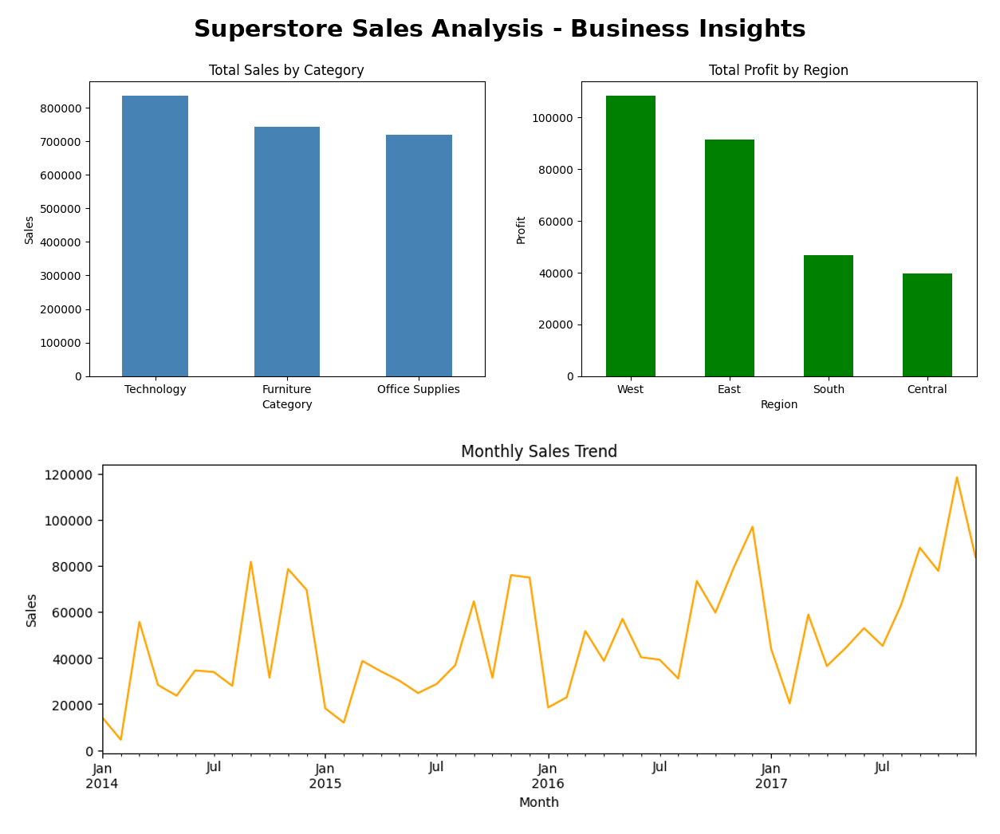

# Superstore Sales Analysis - Business Insights

## Project Overview
Exploratory Data Analysis on real business sales 
data to uncover key trends and insights.

## Tools Used
- Python, Pandas, Matplotlib, Seaborn

## Key Insights

1. Technology is the highest revenue category
2. West region generates the most profit
3. Sales peak in the fall, with spikes every September and November
4. Central region has the lowest profit

## View Full Project on Kaggle
https://www.kaggle.com/code/lalitacanada/superstore-sales-analysis-business-insights
